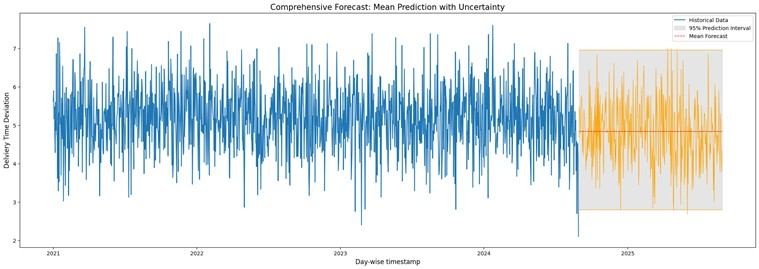
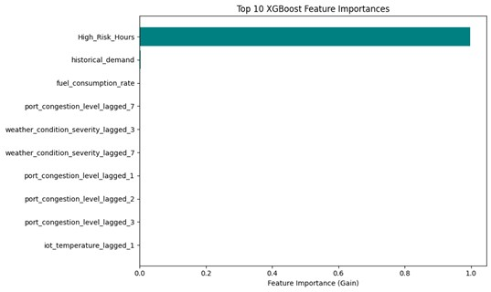

# 🔬 Technical Deep Dive: SARIMAX-XGBoost Cascade

## Phase I: Delivery Deviation Forecasting (SARIMAX)

### 1. Feature Engineering and Aggregation

Raw hourly data was aggregated to a daily cadence based on the feature's operational significance:

* **Maximum (Max) Aggregation:** Used for **Worst-Case Stress Drivers** (e.g., Max Traffic, Max Weather) to capture the single bottleneck hour that dictates the day's total risk.
* **Mean (Average) Aggregation:** Used for **Rate-Based Metrics** and **Target Variables** (e.g., **P**High-Risk) to provide a stable, representative figure for time-series modelling.
* **Sum Aggregation:** Used for **Cumulative Totals** (e.g., Total Volume Processed) to measure the day's total operational load.

### 2. Stationarity and Multicollinearity

* **Stationarity:** The target series was stabilized using **first-order differencing ($\mathbf{d=1}$)** to meet the statistical requirements for $\text{ARIMAX}$ modeling.
* **VIF Filtering:** Exogenous features were subject to an iterative removal process until all remaining variables had a Variance Inflation Factor ($\text{VIF}$) **< 5** to ensure the stability and interpretability of $\text{SARIMAX}$ coefficients.

### SARIMAX Forecast Validation (Monte Carlo)

The Phase I model provides a stable, forward-looking prediction (black line) bounded by the 95% prediction interval (shaded area), quantifying forecast uncertainty and providing the critical temporal feature for the XGBoost model.

## Phase II: Risk Proportion Classification (XGBoost Regressor)

### 1. Cascade Architecture

The $\text{XGBoost}$ regressor utilizes the Phase I forecast (**SARIMAX_Predicted_Delay**) as its most powerful temporal feature, combining it with essential lagged operational features (system memory) and remaining VIF-filtered external variables.

### 2. Feature Importance Insights (Gain Metric)

* **Lagged Persistence Dominance:** The most critical feature was the previous day's risk ($\mathbf{P}_{\text{High\_Risk}_{t-1}}$), confirming that **system memory** (backlog and residual stress) dictates the majority of the current day's risk.
* **Cascade Validation:** The high ranking of the **SARIMAX_Predicted_Delay** feature validated the architecture, proving that the specialized temporal output from Phase I provided non-redundant predictive gain for the final risk score.

#### Feature Importance Analysis (Gain Metric)

The visual dominance of the features on this plot proves the project's core diagnostic findings: **Lagged Risk** (System Memory) is the primary driver, while the **SARIMAX Predicted Delay** (our cascade output) is ranked highly, validating the two-stage architecture.

## Strategic Output: Dynamic Percentile Bucketing (DPB)

Given the model's diagnostic finding of a chronic $\mathbf{\sim 75\%}$ risk baseline, the DPB technique was developed to make the saturated forecast actionable. DPB classifies the forecast distribution into relative risk categories (Low, Moderate, High) using the $25^{\text{th}}$ and $75^{\text{th}}$ percentiles as dynamic thresholds. This transforms the output from an absolute measure of high risk into a relative measure of **operational volatility**, allowing for highly targeted resource deployment.
